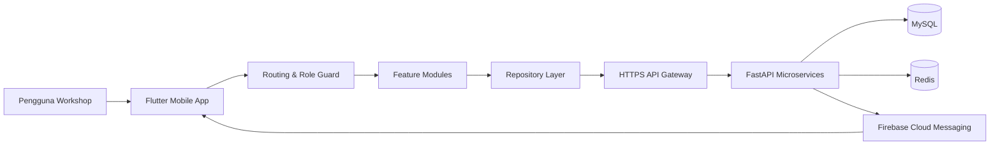

<!--
Tujuan: Memperkenalkan SM-MIS Workshop Mobile sebagai portofolio produk dan engineering.
Caller: Recruiter, calon klien, stakeholder, developer, dan reviewer teknis.
Dependensi: Flutter app, REST API microservices, MySQL, Redis, dan Firebase Cloud Messaging.
Main Functions: Ringkasan produk, kontribusi teknis, arsitektur, fitur, dan panduan menjalankan project.
Side Effects: Tidak ada.
-->

# SM-MIS Workshop Mobile

**Aplikasi operasional bengkel yang menyatukan perencanaan, pengerjaan, kontrol kualitas, dan kebutuhan gudang dalam satu alur kerja.**

SM-MIS Workshop Mobile dibangun untuk menjawab masalah yang sangat nyata di lantai produksi: pekerjaan tersebar di banyak catatan, progres sulit dilacak, penggunaan jam kerja tidak transparan, dan kebutuhan barang sering terputus dari pekerjaan yang membutuhkannya.

Alih-alih menjadi sekadar aplikasi checklist, SM-MIS menghubungkan seluruh perjalanan pekerjaan—mulai dari target kendaraan dibuat, tugas dibagikan kepada mekanik, waktu kerja dicatat, hasil diperiksa QC, hingga material dan spare part diajukan. Setiap aktivitas membawa konteks yang sama, sehingga tim lapangan dan manajemen melihat sumber data yang konsisten.

> Project ini menunjukkan bagaimana saya menerjemahkan proses bisnis bengkel yang kompleks menjadi aplikasi mobile yang terstruktur, aman, dan tetap praktis digunakan oleh tim operasional.

## Masalah yang Diselesaikan

Operasional bengkel memiliki banyak titik yang mudah kehilangan konteks. Sebuah pekerjaan bisa dimulai dari target produksi, berubah karena kerusakan tambahan, membutuhkan bantuan divisi lain, tertunda karena material, lalu kembali lagi karena tidak lolos QC.

SM-MIS menjaga seluruh rangkaian itu tetap terhubung:

- target pekerjaan diturunkan menjadi rencana harian yang terukur;
- mekanik hanya melihat tugas yang relevan dengan peran dan penugasannya;
- waktu aktual dibandingkan dengan target dan sisa budget pekerjaan;
- pekerjaan yang selesai masuk ke alur Quality Control;
- pekerjaan tambahan, lintas divisi, dan vendor memiliki jalur pengajuan sendiri;
- permintaan gudang dan pembelian tetap terhubung dengan unit atau tugas asal;
- pihak terkait menerima notifikasi ketika ada pekerjaan yang membutuhkan perhatian.

Hasil akhirnya bukan hanya pencatatan yang lebih rapi. Sistem membentuk jejak operasional yang bisa digunakan untuk mengevaluasi progres kendaraan, akurasi perencanaan, penggunaan jam kerja, dan hambatan produksi.

## Fitur Utama

### Perencanaan dan monitoring pekerjaan

- **Countdown** untuk melihat target, progres, sisa jam, dan milestone kendaraan.
- **Job Plan** untuk membagi pekerjaan harian kepada PIC berdasarkan kapasitas yang tersedia.
- Dukungan **multijob** dan alokasi pekerjaan berurutan agar jadwal seorang mekanik tidak saling bertabrakan.
- Monitoring lintas unit dan divisi sesuai cakupan akses pengguna.

### Eksekusi tugas di lapangan

- Mekanik dapat memulai, memperbarui, dan menyelesaikan tugas dari perangkat mobile.
- Durasi aktual, progres, catatan, dan foto pekerjaan tersimpan sebagai satu laporan.
- Draft lokal membantu menjaga input saat aplikasi terputus atau proses belum selesai.
- Pengingat dan alarm membantu pengguna merespons batas waktu pekerjaan.

### Quality Control dan rework

- Pekerjaan selesai masuk ke antrean QC untuk dinilai.
- QC dapat meluluskan pekerjaan atau mengembalikannya sebagai rework dengan catatan yang jelas.
- Foto bukti dan histori pemeriksaan menjaga keputusan tetap dapat ditelusuri.

### Work Order, Additional, dan vendor

- **Additional** menangani pekerjaan tambahan yang ditemukan di tengah proses.
- **Work Order (WO)** mengatur kebutuhan pekerjaan lintas divisi internal.
- **Work Order Vendor (WOV)** digunakan ketika pekerjaan perlu ditangani pihak eksternal.
- Setiap jalur memiliki konteks unit, target, status, dan persetujuan yang sesuai.

### Warehouse dan Purchase Request

- Pengajuan peminjaman, pengambilan, pengembalian, dan penyimpanan barang.
- Alur persetujuan berjenjang untuk divisi, warehouse, dan PPIC.
- Monitoring barang yang sedang digunakan beserta PIC dan divisinya.
- Riwayat serta aktivitas warehouse dapat ditelusuri per tanggal.
- Purchase Request menangani kebutuhan barang yang belum tersedia.

### Akses berbasis peran

Tampilan dan data disesuaikan dengan tanggung jawab pengguna—mulai dari anggota lapangan, Ketua Divisi, Advisor, Kepala Pool, hingga level manajemen dan administrator. Sistem menggabungkan role mapping di aplikasi dengan permission dari backend agar menu, tindakan, dan cakupan data tetap terkendali.

## Bagian Engineering yang Menarik

### 1. Satu proses bisnis, banyak jalur yang tetap terhubung

Tantangan terbesar project ini bukan membuat halaman, melainkan menjaga konteks ketika sebuah pekerjaan berpindah dari perencanaan ke eksekusi, QC, gudang, atau divisi lain. Setiap modul dibuat feature-first, tetapi tetap memakai ID dan kontrak data yang konsisten agar alurnya bisa ditelusuri dari awal sampai akhir.

### 2. Perhitungan waktu tidak berhenti pada stopwatch

Sistem membedakan target harian, waktu aktual, jam normal, overtime, dan sisa budget kendaraan. Saat pekerjaan melewati target, backend memeriksa shared panel pool dan unit budget sebelum menetapkan overtime. Pendekatan ini membuat data waktu lebih dekat dengan kondisi bisnis sebenarnya.

### 3. Mobile app yang siap menghadapi kondisi lapangan

Koneksi di area kerja tidak selalu ideal. Karena itu aplikasi memiliki penyimpanan draft lokal, pesan error yang lebih ramah, retry pada proses tertentu, recovery untuk input QC, serta upload foto melalui presigned URL. Pengguna tidak perlu memahami detail jaringan untuk tahu apa yang harus dilakukan saat terjadi gangguan.

### 4. Keamanan ditempatkan di jalur utama

- API production menggunakan gateway HTTPS dengan validasi sertifikat platform.
- Token sesi dan refresh flow ditangani terpusat oleh network client.
- Request otomatis membawa authorization header yang sesuai.
- Aksi sensitif dibatasi oleh role dan permission.
- Upload file menggunakan ticket sementara, bukan kredensial storage di aplikasi.

## Arsitektur



Aplikasi mobile menggunakan struktur feature-first dengan pemisahan layer:

```text
lib/
├── core/                       # network, session, routing, theme, services
└── features/
    └── <feature>/
        ├── data/               # datasource dan repository implementation
        ├── domain/             # entity, contract, dan use case
        └── presentation/       # page, widget, dan state management
```

Alur data utamanya:

```text
Page / Widget
    → Bloc atau page state
    → Repository contract
    → Remote datasource
    → API gateway
    → Microservice terkait
```

## Tech Stack

| Area | Teknologi |
|---|---|
| Mobile | Flutter, Dart |
| State management | flutter_bloc, StatefulWidget untuk state lokal |
| Navigation | go_router |
| Dependency injection | get_it |
| Networking | Dio, HTTP |
| Backend integration | REST API, FastAPI microservices |
| Data | MySQL, Redis, SharedPreferences |
| Notification | Firebase Cloud Messaging, local notifications |
| Media | Camera, image compression, presigned upload URL |
| Testing | flutter_test |

## Modul yang Tersedia

| Modul | Tanggung jawab utama |
|---|---|
| Authentication | Device initialization, login, session, dan role profile |
| Home | Navigasi fitur berdasarkan akses pengguna |
| Countdown | Target dan progres kendaraan |
| Job Plan | Perencanaan serta pembagian kerja harian |
| Task Execution | Eksekusi, durasi, progres, dan bukti pekerjaan |
| Monitoring | Ringkasan progres lintas unit dan divisi |
| Quality Control | Inspeksi, pass, reject, dan rework |
| Work Order | Pekerjaan lintas divisi |
| WOV | Pekerjaan vendor eksternal |
| Warehouse Request | Permintaan, pemakaian, dan histori barang |
| Purchase Request | Pengajuan pengadaan barang |
| Notifications | Inbox notifikasi operasional |
| Profile | Informasi pengguna dan logout |

## Menjalankan Project

### Prasyarat

- Flutter SDK yang kompatibel dengan Dart `>=3.11.0 <4.0.0`
- Android Studio atau Xcode untuk emulator/perangkat
- Akses ke API SM-MIS untuk menggunakan data nyata

### Instalasi

```bash
flutter pub get
flutter run
```

Secara default aplikasi menggunakan gateway production:

```text
https://api.stanleymarthin.com
```

Base URL dapat diarahkan ke environment lain melalui `dart-define`:

```bash
flutter run --dart-define=BASE_URL=https://example-api.internal
```

### Pemeriksaan kualitas

```bash
flutter analyze
flutter test
```

Test yang tersedia mencakup kontrak endpoint, pemetaan role dan permission, normalisasi data task, alokasi Job Plan, label status, serta filter riwayat warehouse.

## Keputusan Desain

- **Feature-first structure** dipilih agar perubahan pada satu domain tidak menyebar ke seluruh project.
- **Repository abstraction** menjaga presentation layer tidak bergantung langsung pada bentuk response API.
- **Centralized session dan network client** mengurangi duplikasi token handling serta error mapping.
- **Permission-driven UI** membuat satu aplikasi dapat melayani banyak level pengguna.
- **Remote-first dengan local recovery** menjaga backend sebagai sumber data utama tanpa mengabaikan kondisi perangkat di lapangan.

## Status Project

SM-MIS Workshop Mobile adalah aplikasi bisnis yang terus berkembang mengikuti proses operasional workshop. Repository ini berfokus pada sisi mobile; implementasi backend berjalan sebagai kumpulan microservice terpisah.

Dokumentasi arsitektur dan alur teknis yang lebih rinci tersedia di [SYSTEM_MAP.md](SYSTEM_MAP.md).

---

**Dibangun untuk membuat pekerjaan workshop lebih mudah ditelusuri—dari rencana pertama sampai kendaraan benar-benar selesai.**
