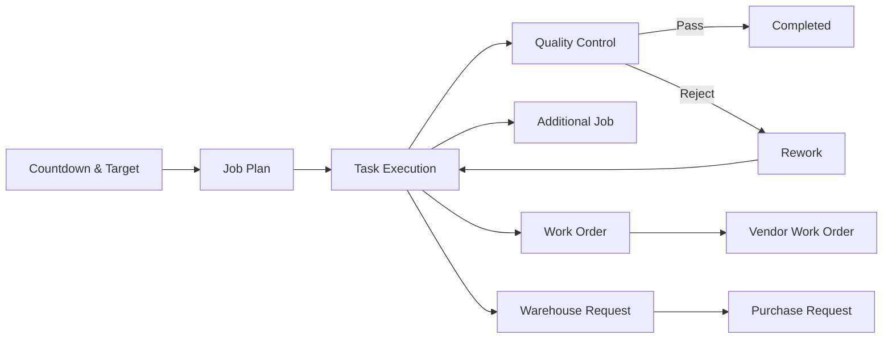
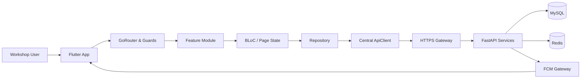

<!--
Tujuan: Memperkenalkan System Stanley Marthin sebagai portofolio engineering untuk reviewer teknis.
Caller: Project Manager, Engineering Manager, senior programmer, developer, dan reviewer arsitektur.
Dependensi: Flutter mobile client, REST API microservices, MySQL, Redis, dan Firebase Cloud Messaging.
Main Functions: Ringkasan scope, arsitektur, keputusan teknis, trade-off, pengujian, dan panduan menjalankan project.
Side Effects: Tidak ada.
-->

# System Stanley Marthin

**Flutter mobile client untuk mengelola workflow workshop dari perencanaan kerja hingga Quality Control, warehouse, dan pengadaan.**

Repository ini memperlihatkan sisi mobile dari **System Stanley Marthin**, sebuah sistem operasional yang menghubungkan banyak proses dan level akses dalam satu aplikasi. Tantangan engineering-nya bukan sekadar menampilkan data, tetapi menjaga state, izin, dan konteks pekerjaan tetap konsisten ketika sebuah job berpindah dari perencanaan ke eksekusi, QC, gudang, atau divisi lain.

## Project Snapshot

| Area | Implementasi |
|---|---|
| Repository scope | Flutter mobile client untuk Android dan iOS |
| Codebase | 182 Dart source files dalam struktur feature-first |
| Architecture | Layered feature modules: data, domain, presentation |
| State management | BLoC untuk workflow utama, local widget state untuk interaksi terisolasi |
| Backend contract | REST API melalui HTTPS gateway ke FastAPI microservices |
| Persistence | MySQL dan Redis di backend; SharedPreferences untuk state lokal tertentu |
| Cross-cutting concerns | Session, RBAC, retry, cache, error mapping, upload, notification |
| Test surface | 13 test files untuk domain helper, model mapping, RBAC, endpoint, dan widget flow |

## Scope Sistem

Alur inti System Stanley Marthin dapat diringkas sebagai berikut:



Satu job dapat menghasilkan pekerjaan tambahan, permintaan lintas divisi, kebutuhan vendor, atau permintaan barang. Semua jalur tersebut tetap membawa konteks unit, divisi, PIC, target, dan approval status. Ini membuat integrasi antarmodul menjadi bagian penting dari desain, bukan hanya detail implementasi UI.

## Fokus Engineering

### 1. Feature-first tanpa memutus alur bisnis

Codebase dipisahkan berdasarkan domain agar ownership dan dampak perubahan lebih mudah dilacak:

```text
lib/
├── core/
│   ├── auth/                   # role mapping dan guards
│   ├── di/                     # dependency registration
│   ├── network/                # API client dan endpoint registry
│   ├── router/                 # route dan session redirect
│   ├── services/               # FCM, upload, notification, alarm
│   ├── session/                # persisted session dan permission snapshot
│   └── theme/                  # shared application theme
└── features/
    └── <feature>/
        ├── data/               # remote/local datasource, repository implementation
        ├── domain/             # entities dan repository contracts
        └── presentation/       # pages, widgets, BLoC, local state
```

Setiap feature dapat berkembang secara relatif mandiri, sementara dependency lintas domain tetap masuk melalui contract atau service di `core`. Untuk trace sebuah flow, titik bacanya konsisten:

```text
Route / user action
    → Page atau BLoC
    → Repository contract
    → Repository implementation
    → Remote datasource
    → API endpoint
```

### 2. Network client sebagai reliability boundary

[ApiClient](lib/core/network/api_client.dart) bukan sekadar wrapper Dio. Komponen ini menjadi boundary untuk perilaku jaringan yang harus konsisten di seluruh feature:

- menyuntikkan bearer token ke request;
- menormalisasi response API;
- memetakan error teknis menjadi failure aplikasi;
- menangani cache untuk request yang relevan;
- melakukan retry pada kondisi yang dapat dipulihkan;
- menahan request ketika session sedang di-refresh;
- menyatukan concurrent refresh melalui satu `Completer` agar tidak terjadi refresh storm.

Default production menggunakan gateway HTTPS dan validasi sertifikat platform. Feature tidak perlu mengulang token handling atau menerjemahkan error Dio sendiri.

### 3. Session dan authorization dua lapis

[SessionManager](lib/core/session/session_manager.dart) menyimpan profil akses dari backend, termasuk role, permission codes, access bucket, dan scope basis. Di sisi UI, [RBAC](lib/core/auth/rbac.dart) menyediakan permission mapping dan guard untuk navigasi serta action-level visibility.

Keduanya melayani kebutuhan berbeda:

| Lapisan | Tanggung jawab |
|---|---|
| Backend-driven permissions | Sumber izin aktual dan scope data pengguna |
| Mobile role mapping | Kompatibilitas tampilan serta perilaku role yang sudah ada |
| Route/widget guards | Mencegah fitur atau aksi tampil pada pengguna tanpa akses |
| Repository/API scope | Memastikan request membawa konteks data yang sesuai |

Pendekatan ini memungkinkan migrasi bertahap dari role-based behavior lama menuju permission-driven access. Konsekuensinya, sinkronisasi kedua lapisan perlu diawasi agar tidak terjadi drift.

### 4. State dibagi berdasarkan umur dan risiko data

Tidak semua state diperlakukan sama:

- **BLoC** digunakan untuk proses dengan transisi dan side effect yang jelas, seperti autentikasi, task execution, dan Work Order.
- **Local widget state** digunakan untuk filter, pilihan sementara, dan interaksi yang tidak perlu hidup di luar page.
- **SharedPreferences** menyimpan session snapshot dan recovery state tertentu.
- **Task draft storage** menjaga input eksekusi yang belum selesai.
- **QC recovery state** memungkinkan proses inspeksi dibuka kembali setelah interupsi aplikasi.
- **Redis di backend** digunakan untuk state yang perlu dibagi antarpengguna atau memiliki lifecycle singkat, seperti draft plan dan shared time pool.

Pembagian ini menghindari global state yang terlalu besar, tetapi tetap memberi jalur recovery untuk workflow lapangan yang tidak boleh hilang saat aplikasi ditutup.

### 5. Upload file tanpa membawa credential storage

Foto task, QC, dan warehouse menggunakan pola upload dua tahap:

```text
Mobile app
    → meminta upload ticket ke API
    → menerima presigned URL sementara
    → mengunggah binary langsung melalui HTTP PUT
    → mengirim URL hasil ke transaksi utama
```

Credential object storage tidak disimpan di aplikasi. [UploadService](lib/core/services/upload_service.dart) memusatkan proses ticket dan upload agar feature hanya menangani hasil serta failure state.

### 6. Domain waktu lebih kompleks dari timer UI

Task execution membawa beberapa konsep waktu sekaligus: target harian, actual duration, normal hours, overtime, progress, dan remaining work. Di backend, kelebihan durasi diperiksa terhadap shared panel pool dan sisa unit budget sebelum ditetapkan sebagai overtime final.

Di mobile, helper dan model mapping menjaga alias payload, tanggal task, sesi parsial, serta nilai kumulatif tetap diterjemahkan secara konsisten. Test pada area ini ditujukan untuk melindungi aturan yang mudah mengalami regresi ketika kontrak API berkembang.

## Modul dan Ownership

| Modul | Responsibility | State/data path utama |
|---|---|---|
| Authentication | Device init, login, refresh, session restore | AuthBloc → repository → auth datasource |
| Countdown | Target dan progres kendaraan | Page state → repository → countdown API |
| Job Plan | Planning, allocation, multijob | Page/helper → repository → job plan API |
| Task Execution | Start, progress, submit, draft | TaskBloc → repository → task API/storage |
| Monitoring | Overview unit dan divisi | Page → repository → countdown aggregation |
| Quality Control | Queue, pass, reject, rework | QC page → repository → QC API |
| Work Order | Pekerjaan lintas divisi | WorkOrderBloc → repository → WO API |
| WOV | Pekerjaan vendor | Page → remote datasource → PR/WOV API |
| Warehouse | Request, approval, usage, history | Page state → repository → warehouse API |
| Purchase Request | Pengadaan dan approval | Page → remote datasource → PR API |
| Notifications | Local inbox dari FCM payload | FCM service → notification inbox storage |
| Profile | User profile dan logout cleanup | Page → repository → profile API/session |

## Runtime Architecture



Backend berjalan sebagai beberapa service terpisah untuk auth, task, job plan, countdown, QC, warehouse, Work Order, PR/WOV, dan notification. Source backend tidak berada di repository ini; mobile berinteraksi melalui kontrak endpoint yang didefinisikan di [ApiEndpoints](lib/core/network/api_endpoints.dart).

## Testing Strategy

Test suite saat ini berfokus pada logic yang memiliki risiko regresi tinggi:

- role, permission, dan scope normalization;
- parsing model dari variasi payload backend;
- aturan operator task dan status sesi parsial;
- alokasi jam dan normalisasi jadwal Job Plan;
- label status serta formatter domain;
- kontrak base URL dan endpoint gateway;
- pemfilteran histori warehouse berdasarkan tanggal;
- branching halaman berdasarkan level akses pengguna.

Jalankan pemeriksaan lokal dengan:

```bash
flutter analyze
flutter test
```

Area berikutnya yang layak diperluas adalah repository integration test, widget test untuk critical flow, dan E2E test pada login → plan → execute → QC.

## Security dan Failure Handling

- Production transport menggunakan HTTPS tanpa global certificate bypass.
- Token injection dan refresh dikelola terpusat.
- Authorization tidak hanya mengandalkan visibilitas menu; action dan scope data juga diperiksa.
- Upload menggunakan presigned ticket dengan lifecycle terbatas.
- Error jaringan dipetakan ke pesan yang dapat ditindaklanjuti pengguna.
- Side effect utama memiliki loading, success, dan failure path yang eksplisit.
- Session cleanup dan task draft cleanup dijalankan saat logout.

## Trade-off dan Technical Debt

Bagian ini sengaja ditulis terbuka karena menjadi konteks penting untuk reviewer teknis.

| Area | Kondisi saat ini | Arah perbaikan |
|---|---|---|
| Session storage | Wrapper bernama secure storage masih berbasis SharedPreferences | Migrasi token ke encrypted platform storage |
| Access control | Backend permission dan mobile role mapping berjalan paralel | Satukan policy evaluation di permission-driven layer |
| Monitoring | Sebagian data dibentuk dari beberapa call countdown | Sediakan dedicated monitoring endpoint |
| Presentation layer | Beberapa page besar memegang terlalu banyak UI dan orchestration | Ekstrak controller, section widget, dan domain helper bertahap |
| State consistency | BLoC dan StatefulWidget dipakai berdampingan | Tetapkan boundary berdasarkan lifecycle dan side effect |
| Offline support | Recovery tersedia untuk draft tertentu, bukan full offline sync | Tambahkan local queue dan conflict strategy jika dibutuhkan |
| Test coverage | Unit/domain test sudah ada, integration dan E2E masih terbatas | Prioritaskan critical path dan contract tests |

Trade-off tersebut tidak disembunyikan sebagai detail implementasi. Masing-masing memengaruhi maintainability, keamanan, atau biaya perubahan berikutnya.

## Tech Stack

| Area | Teknologi |
|---|---|
| Mobile | Flutter, Dart |
| State management | flutter_bloc, StatefulWidget |
| Navigation | go_router |
| Dependency injection | get_it |
| Networking | Dio, HTTP |
| Serialization | json_annotation, json_serializable |
| Functional error handling | fpdart |
| Local persistence | SharedPreferences |
| Notification | Firebase Cloud Messaging, local notifications |
| Device integration | Camera, permission handler, geolocation, wakelock |
| Testing | flutter_test |

## Menjalankan Project

### Prasyarat

- Flutter SDK dengan Dart `>=3.11.0 <4.0.0`
- Android Studio atau Xcode
- Emulator atau perangkat fisik
- Akses API untuk menggunakan data runtime nyata

### Setup

```bash
flutter pub get
flutter run
```

Default API mengarah ke gateway production. Environment lain dapat digunakan melalui `dart-define`:

```bash
flutter run --dart-define=BASE_URL=https://example-api.internal
```

## Review Guide

Untuk memahami codebase tanpa blind scan, mulai dari file berikut:

1. [SYSTEM_MAP.md](SYSTEM_MAP.md) — peta arsitektur, route, role, endpoint, dan flow utama.
2. [main.dart](lib/main.dart) — startup serta initialization order.
3. [app_router.dart](lib/core/router/app_router.dart) — route map dan session redirect.
4. [injection.dart](lib/core/di/injection.dart) — dependency graph.
5. [api_client.dart](lib/core/network/api_client.dart) — auth, cache, retry, refresh, dan error boundary.
6. [session_manager.dart](lib/core/session/session_manager.dart) — session, permission, serta access scope.
7. Pilih satu feature lalu trace `presentation → domain → data`.

## Repository Boundary

Repository ini berisi Flutter mobile client. Backend FastAPI, database schema runtime, dan deployment service dikelola terpisah. `SYSTEM_MAP.md` mencatat kontrak serta hubungan yang terlihat dari sisi aplikasi, tetapi implementasi backend tetap menjadi source of truth untuk business rule server-side.

---

**System Stanley Marthin menunjukkan bagaimana workflow operasional yang saling bergantung diterjemahkan menjadi mobile architecture yang dapat ditelusuri, diuji, dan dikembangkan bertahap.**
